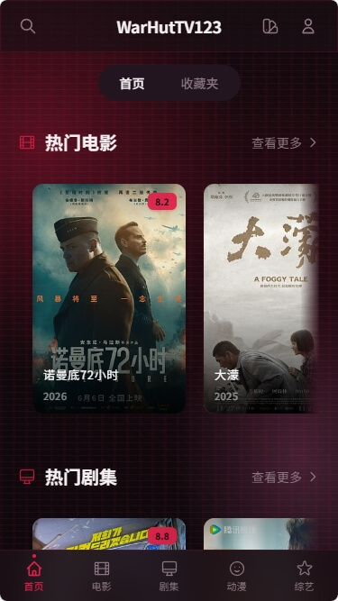

<p align="center">
  
</p>

<h1 align="center">WarHutTV</h1>

<p align="center">
  基于 <b>Go + Gin</b> 和 <b>React + Vite</b> 的影视聚合播放器
</p>

<p align="center">
  
  
  
  
  
</p>

---

## 📸 截图预览

<details open>
<summary><b>🖥️ 桌面端</b></summary>
<br>
<p align="center">
  
</p>
</details>

<details>
<summary><b>📱 移动端</b></summary>
<br>
<p align="center">
  
</p>
</details>

---

## ✨ 功能特性

| 功能 | 说明 |
|------|------|
| 🔍 **多源聚合搜索** | SSE 流式搜索，同时查询多个资源站，实时展示进度 |
| ▶️ **在线播放** | 基于 HLS.js + Artplayer，支持广告过滤、倍速播放、画中画 |
| 🧠 **智能优选** | 自动测速多个播放源，选择速度最快的源 |
| 📺 **直播频道** | 支持 M3U/TXT 格式直播源，分组管理，快捷键切换 |
| ❤️ **收藏** | IndexedDB 本地存储，无需登录即可收藏 |
| 📖 **观看历史** | 自动记录播放进度，支持续播 |
| 🎬 **豆瓣 / Bangumi** | 首页展示热门电影、剧集、新番，发现好片 |
| 📱 **响应式布局** | 桌面端侧边栏 + 移动端底部导航，自适应 |
| 🔒 **密码保护** | JWT 认证，支持环境变量配置 |

---

## 🚀 快速开始

### 环境要求

- **Go** 1.21+
- **Node.js** 18+
- **npm** 9+

### 开发模式

```bash
# 克隆项目
git clone https://github.com/OuOumm/WarHutTV.git
cd WarHutTV

# 启动后端（默认 :3000）
cd backend && go run main.go

# 新终端，启动前端（Vite dev server :5173，代理到后端）
cd frontend && npm run dev
```

浏览器打开 `http://localhost:5173`

### 生产构建

```bash
make build    # 构建前端 + 后端，输出到 bin/
make run      # 直接运行
```

跨平台构建脚本（构建 5 个平台）：

```bash
# Linux / macOS
chmod +x build.sh && ./build.sh

# Windows PowerShell
powershell -ExecutionPolicy Bypass -File build.ps1
```

构建产物在 `bin/` 目录下：

```
bin/
├── warhutv-linux-amd64
├── warhutv-linux-arm64
├── warhutv-windows-amd64.exe
├── warhutv-darwin-amd64
└── warhutv-darwin-arm64
```

---

## 🐳 Docker 部署

### 使用预构建镜像

```bash
docker pull ghcr.io/OuOumm/warhutv:latest
docker run -d \
  --name warhutv \
  -p 3000:3000 \
  -e PASSWORD=your_password \
  -e JWT_SECRET=your_secret \
  -v ./data:/root/data \
  ghcr.io/OuOumm/warhutv:latest
```

### 本地构建

```bash
docker build -t warhutv .
docker run -d --name warhutv -p 3000:3000 -e PASSWORD=your_password warhutv
```

### Docker Compose

```yaml
services:
  warhutv:
    build: .
    ports:
      - "3000:3000"
    environment:
      - PASSWORD=your_password
      - JWT_SECRET=your_secret
    volumes:
      - ./data:/root/data
    restart: unless-stopped
```

---

## ⚙️ 配置

编辑 `data/config.json`：

```json
{
  "site_name": "WarHutTV",
  "announcement": "欢迎使用 WarHutTV",
  "password": "your_password",
  "jwt_secret": "your_secret",
  "api_site": {
    "source1": {
      "api": "http://example.com/api.php/provide/vod",
      "name": "资源站 1"
    }
  },
  "live_config": [
    {
      "key": "live1",
      "name": "直播源 1",
      "url": "http://example.com/live.m3u"
    }
  ]
}
```

### 环境变量

| 变量 | 说明 | 默认值 |
|------|------|--------|
| `PORT` | 服务端口 | `3000` |

密码和 JWT 密钥在 `data/config.json` 中配置：

```json
{
  "password": "your_password",
  "jwt_secret": "your_secret"
}
```

> ⚠️ 生产环境请务必修改 `password` 和 `jwt_secret`

---

## 🛠️ 开发指南

### 项目结构

```
WarHutTV/
├── backend/
│   ├── main.go              # 入口，路由注册
│   ├── config/              # 配置加载
│   ├── handlers/            # HTTP 处理器
│   ├── middleware/           # CORS、JWT 认证
│   ├── services/            # 代理搜索、直播、缓存
│   └── utils/               # JWT 工具
├── frontend/
│   ├── src/
│   │   ├── api/             # API 客户端
│   │   ├── components/      # UI 组件
│   │   ├── pages/           # 页面
│   │   ├── store/           # 状态管理 + IndexedDB
│   │   └── utils/           # 工具函数
│   └── vite.config.ts
├── data/
│   └── config.json          # 运行时配置
├── Dockerfile
├── Makefile
└── build.ps1
```

### 常用命令

```bash
make dev              # 前端开发服务器
make build            # 完整构建
make run              # 运行（go run）
make clean            # 清理构建产物
make docker           # 构建 Docker 镜像
```

---

## 📦 GitHub Actions

项目配置了 CI/CD 自动化流程：

- **`ci.yml`** — 推送到 `main` 时自动构建，验证代码可用性
- **`release.yml`** — 创建 Tag 时自动构建多平台二进制 + Docker 镜像，发布到 GitHub Releases

### 发布流程

```bash
git tag v1.0.0
git push origin v1.0.0
```

自动构建产物：
- `warhutv-linux-amd64`
- `warhutv-linux-arm64`
- `warhutv-windows-amd64.exe`
- `warhutv-darwin-amd64`（macOS Intel）
- `warhutv-darwin-arm64`（macOS Apple Silicon）
- Docker 镜像推送到 `ghcr.io`

---

## 🙏 致谢

- [LunaTV](https://github.com/MoonTechLab/LunaTV) — 项目灵感来源
- [Artplayer](https://github.com/zhw2590582/ArtPlayer) — 播放器
- [hls.js](https://github.com/video-dev/hls.js) — HLS 支持
- [Dexie.js](https://github.com/dexie/Dexie.js) — IndexedDB 封装

---

## 📄 License

[MIT](LICENSE)
